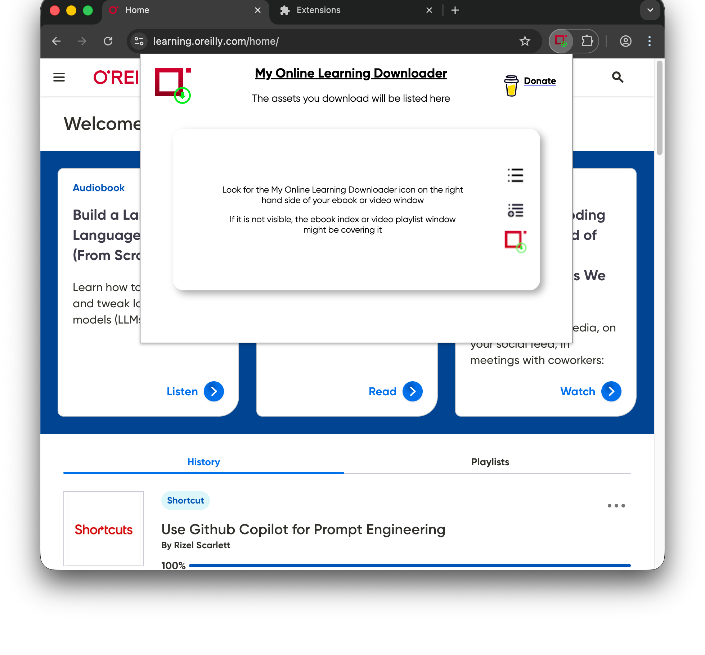
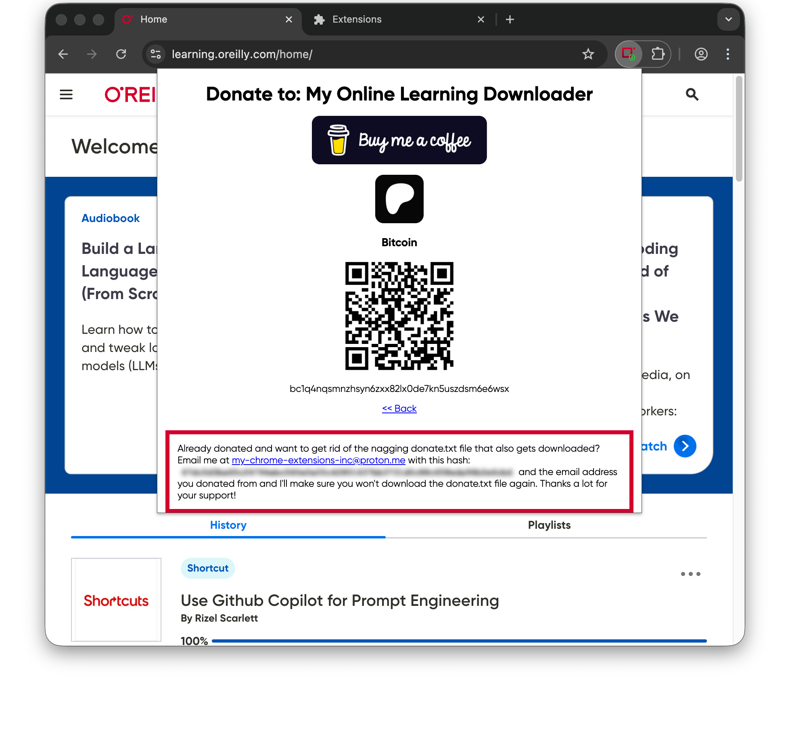

<table border="0" style="background-color: #fff">
  <tr>
    <td><b style="font-size: 2em">Donate by Buying Me A Coffee</b></td>
    <td><b style="font-size: 2em">Donate by Becoming A Patron</b></td>
  </tr>
  <tr>
    <td align="center"><a href="https://www.buymeacoffee.com/my.chrome.extensions.inc" target="_blank"></a></td>
    <td align="center"><a href="https://www.patreon.com/bePatron?u=174105136" target="_blank"></a></td>
  </tr>
</table>

#### Donate Bitcoin


---

## Links to extensions
[Chrome extension](https://chromewebstore.google.com/detail/my-online-learning-downlo/deebiaolijlopiocielojiipnpnaldlk)

[Firefox extension](https://addons.mozilla.org/en-US/firefox/addon/my-online-learning-downloader/)

🗳️ Leave a rating or review if this extension has helped you.

---

# 23 April 2026

My Online Learning Downloader now supports UTF-8 file names, so content downloaded in any non-English language will preserve their original file names. For example, Chinese (Simplified) will download files with their originally intended file names.

### Don't forget to send through your hash to <a href="mailto:my-chrome-extensions-inc@proton.me">my-chrome-extensions-inc@proton.me</a> if you have made a donation, along with your donation's email address, so you no longer receive donate.txt files when downloading.

Instructions on how to get your hash are below

---

# 13 April 2026

Have you donated to My Chrome Extensions, Inc. and want to get rid of the extra donate.txt file that downloads along with your ebooks and videos? Then update to version 1.1.40.1 and follow these instructions:

## Click on the popup icon for My Online Learning Downloader


## Click on the Donate button at the top left


## Follow the instructions at the bottom

---

# 6 March 2026

🐛 Numerous bugs were fixed regarding the download of video courses. Some sub-sections had escape characters that broke downloads on certain operating systems. ON24 (recorded live-lessons) downloads now work again too.
Donations help ensure that timely fixes are implemented for this extension. Please consider making a donation today!

---

## 16 Aug 2025

🐛 A bug was found that prevented ebook, videos and courses from being downloadable. A fix has been implemented and is available in version 1.1.39.6.
Donations help ensure that timely fixes are implemented for this extension. Please consider making a donation today!

## 20 June 2025

🆕 A feature has been launched for On Demand Courses, where if the videos are categorized into Modules, then the Lessons under that Module will be nested beneath it.

e.g.: Module 1: X, Lesson 1: A, Lesson 2: B will be under the following structure when downloaded:

```
~/Some Course Name (2025)/Module 1 - X/Lesson 1 - A/001. Video1.mp4
~/Some Course Name (2025)/Module 1 - X/Lesson 1 - A/002. Video2.mp4
~/Some Course Name (2025)/Module 1 - X/Lesson 1 - A/003. Video3.mp4
~/Some Course Name (2025)/Module 1 - X/Lesson 2 - B/...
~/Some Course Name (2025)/Module 1 - X/Lesson 2 - C/...
~/Some Course Name (2025)/Module 1 - X/Lesson 2 - D/...
...
```

## 17 June 2025

🪙 Even more donations have come in, and your support and kind words are appreciated. Thank you.

⬇️ Downloading of recorded live-lessons now works again, download version 1.1.39.2 to get the feature back.

## 7 June 2025

### Thank you to the **0.1%** of you (number of donations ÷ number of users) who have donated.

🪙 Donations help keep this extension maintained and published.

📈 There are a significant amount of heavy users from **major** corporations, libraries and colleges/universities who could easily donate toward the efforts of this extension. Please consider supporting the tools that are helping you on your learning journey.

---

### Bug fixes in version 1.1.39.6
eBooks, videos and courses should now be available for download again.

### Feature enhancement in 1.1.39.4
* On Demand Courses (videos) will now nest lessons into their respective Module folders, if they exist.
* The year of the course will now be included into the course title of the directory it is downloaded in. e.g.: `Some Course Name (2025)`
* Some general directory naming clean up

### Bug fixes in version 1.1.39.2
Live-lesson recorded sessions can now be downloaded again, along with their captions.

### Bug fixes in version 1.1.39.0
In some video courses, the first chapter showing the course introduction would not be in the list of downloadable content. This has been fixed.

---

**Contact:** my-chrome-extensions-inc ** at ** proton ** dot ** me
